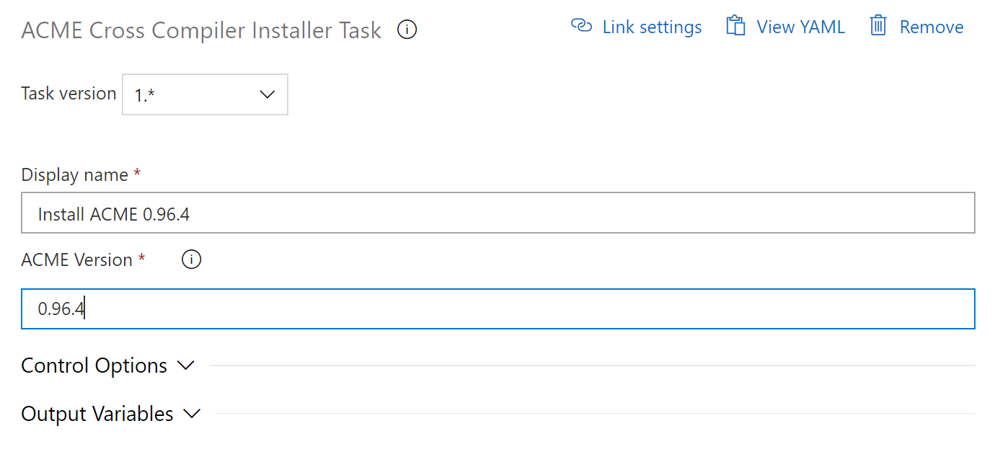
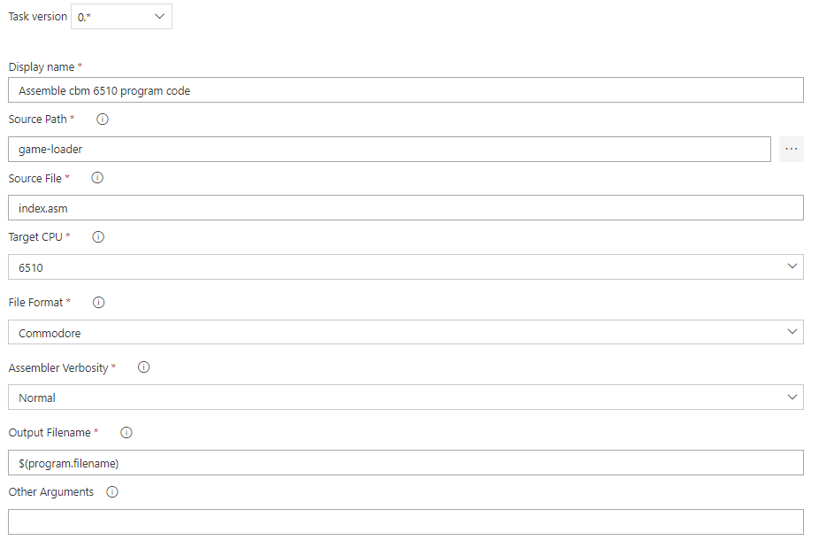

# ACME Assemble Program

Assemble 8-bit machine language programs using the ACME Cross Assembler.

1. **ACME Install Tool Task**
1. **ACME Cross Assemble Task**

## Details

### ACME Install Tool Task

Installs the [ACME Cross Assembler][acme-link] tool onto a windows based build agent.

[ACME][acme-link] is a free cross assembler released under the GNU GPL. It can produce code for the 6502, 6510 (including illegal opcodes), 65c02 and 65816 processors.

* Display Name: Name of the task to appear in the build editor
* ACME Version: The version of ACME to install in the format [major].[minor].[patch]. Defaults to 0.96.4.

### ACME Cross Assemble Task

Add a new ACME Assemble Program task from the Build category and configure as below.

* Display Name: Name of the task to appear in the build editor
* Source Path: Path to the root directory of your machine code source
* Source File: The main file to assemble eg myprog.asm
* Target CPU: The CPU architecture to assemble for. For Commdoore 64 select 6510
* File Format: The file output flavour to use. Valid options are Commodore, Apple or Plain
* Assembler Verbosity: Select how much information the ACME Assembler will display during the assembly process
* Output Filename: The name of the program file to be created eg myprog.prg. This file will be created in the Build.ArtifactStagingDirectory directory
* Other Arguments: supply any additional arguments that the ACME compiler supports

## Related Azure DevOps Tasks

1. **C64 Disk Image (optional)**
   To create a C64 disk image contining your program you can add Tony Landi's [Commodore Computer Disk Image Task][c64-disk-image-link] which can produce disk images for a range of Commodore disk drives.

## Supported Agents

This extension supports both Hosted and Custom Windows Agents and can be used in both the cloud based Azure Devops service or slef hosted Azure DevOps Server.

## Emulating a Commodore 64

If you dont have a physical C64, there are a variety of excellent emaultation options including:

1. [C64 Forever][c64forever-link] shares the same RetroPlatform family player, database and content management components as the very successful Amiga Forever series. As such, it also embodies decades of experience and refinements and a tradition of innovation and long-term continuity and support.
2. [VICE][vice-link] is a program that runs on a Unix, MS-DOS, Win32, OS/2, BeOS, QNX 4.x, QNX 6.x, Amiga, Syllable or Mac OS X machine and executes programs intended for the old 8-bit computers. VICE emulates the C64, the C64DTV, the C128, the VIC20, PET models, the PLUS4 and the CBM-II (aka C610/C510).

[c64-disk-image-link]: https://marketplace.visualstudio.com/items?itemName=TonyLandi.WinVICEc154DiskImage
[acme-link]: https://sourceforge.net/projects/acme-crossass/
[vice-link]: http://vice-emu.sourceforge.net/
[c64forever-link]: https://www.c64forever.com/
